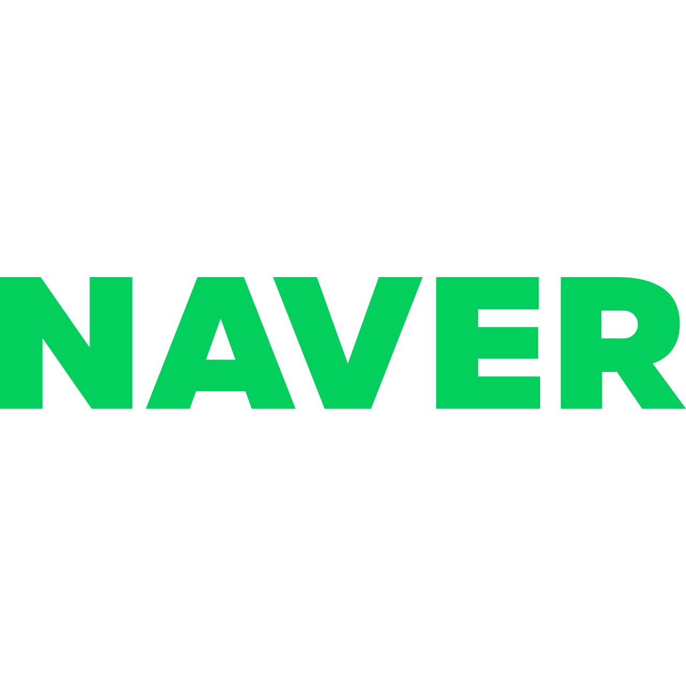
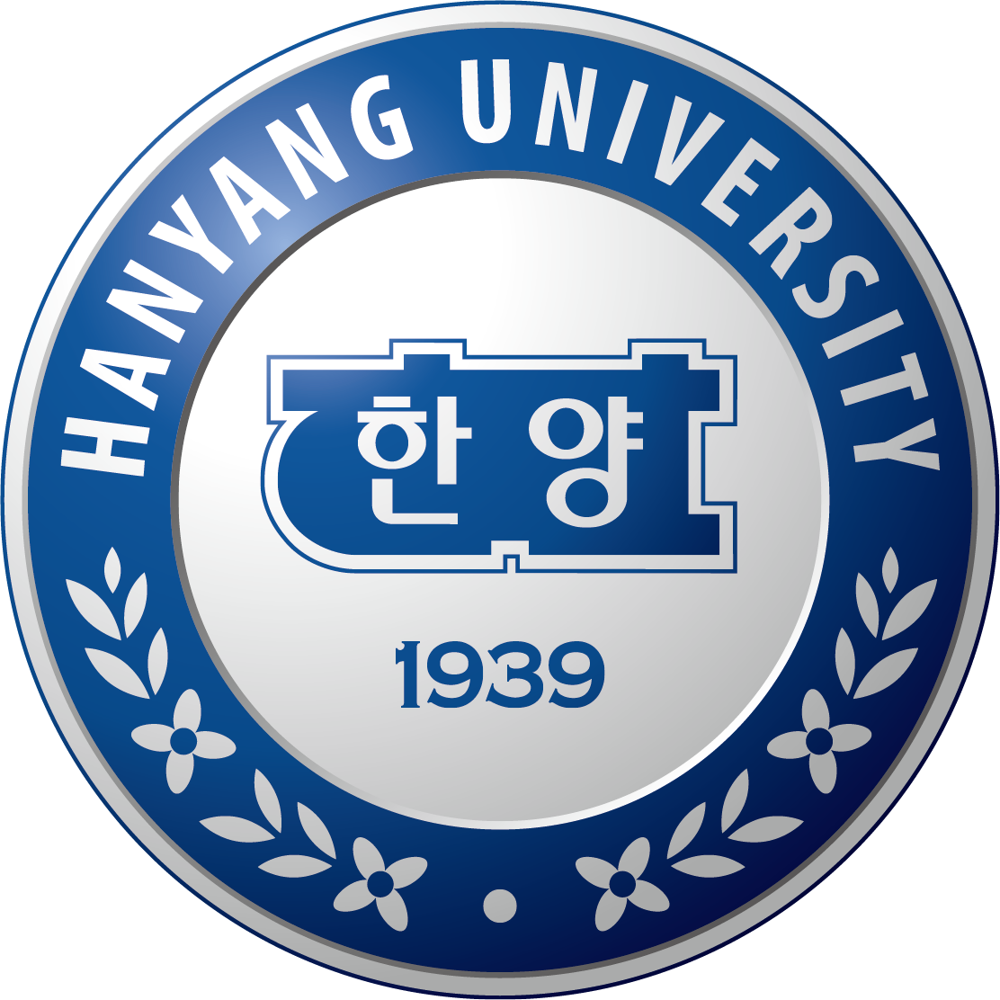
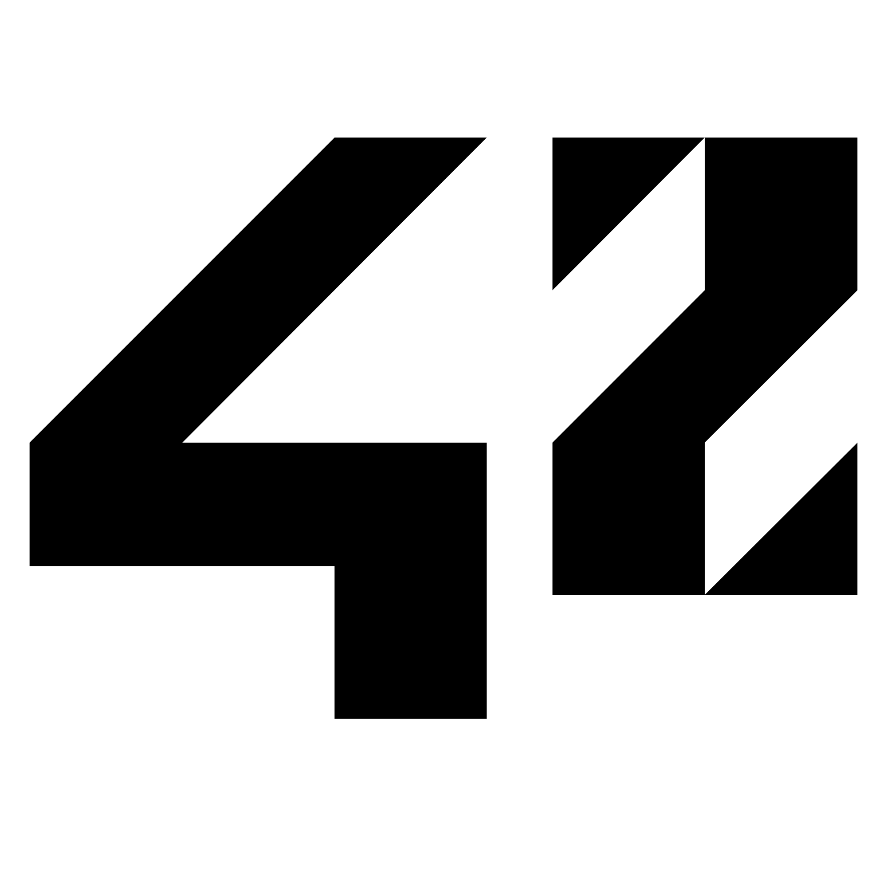
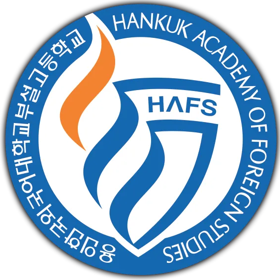
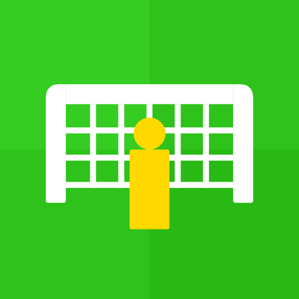

<h2>Inticoy</h2>
Geonwoo Yun · Back-end Developer

I like building useful software, from reliable systems to playful products.

&nbsp;

&nbsp;

 

## Experience

  
  &nbsp;&nbsp;&nbsp;<strong>Back-end Developer</strong> 
  &nbsp;&nbsp;&nbsp;Jan 2026 - Present · NAVER Corp

 

## Education

  
  &nbsp;&nbsp;&nbsp;<strong>Hanyang University</strong> 
  &nbsp;&nbsp;&nbsp;Mar 2019 - Feb 2026 · B.S. Computer Science

 

  <picture>
    <source media="(prefers-color-scheme: dark)" srcset="./assets/42seoul-logo-white.png" />
    
  </picture>
  &nbsp;&nbsp;&nbsp;<strong>42 Seoul</strong> 
  &nbsp;&nbsp;&nbsp;Aug 2022 - Apr 2024 · Cadet

 

  
  &nbsp;&nbsp;&nbsp;<strong>Hankuk Academy of Foreign Studies</strong> 
  &nbsp;&nbsp;&nbsp;Mar 2016 - Feb 2019 · Natural Science Track

 

## Services

  
  &nbsp;&nbsp;&nbsp;<a href="https://github.com/inticoy/snapshoot"><strong>SnapShoot</strong></a> 
  &nbsp;&nbsp;&nbsp;Football penalty shootout game · Launched on App in Toss

 

## Highlights

**2025** · Kaggle CIBMTR, Bronze Medal
 **2023** · Metaverse Developer Contest, Excellence Award
 **2022** · Sleep AI Challenge, 2nd Place
 **2021** · UNITHON 8, Special Award
